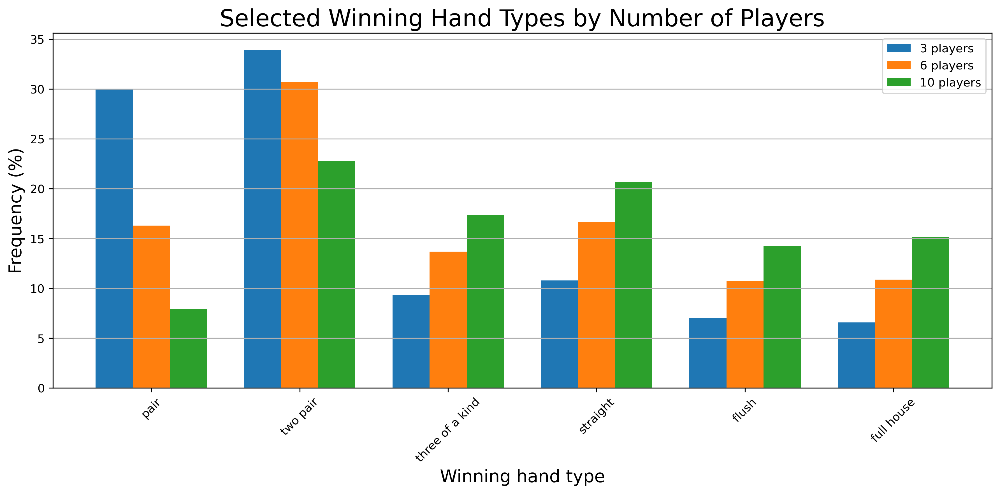
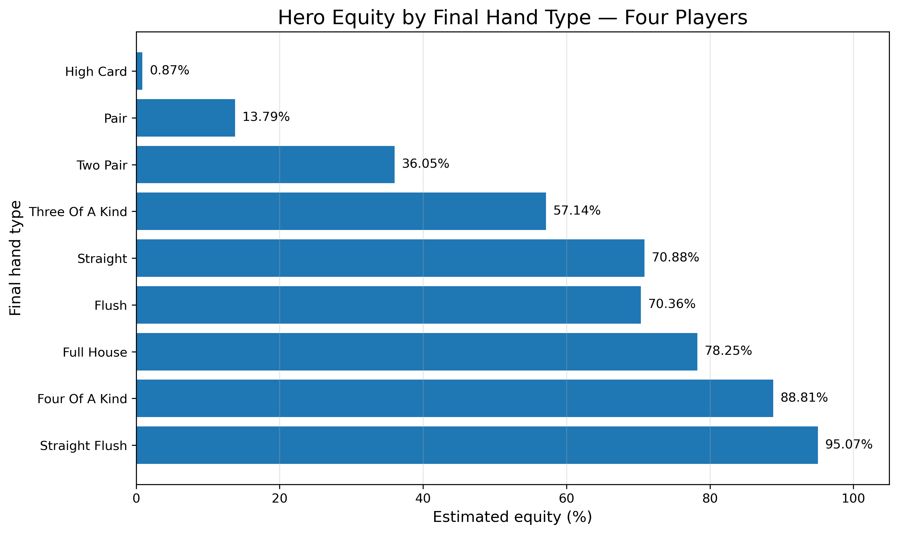
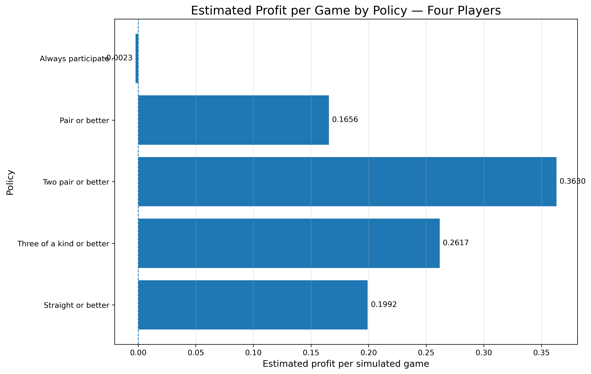
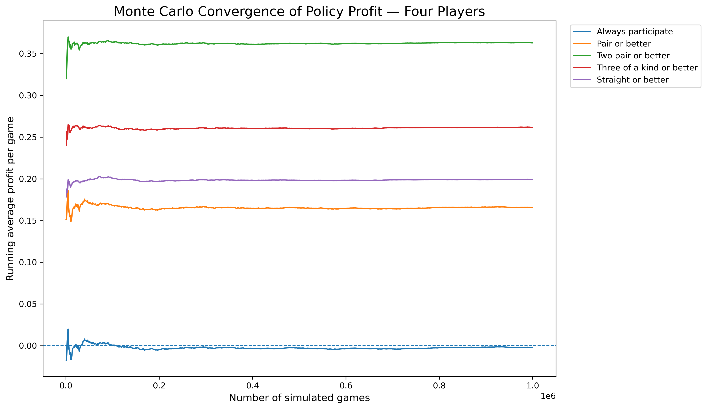

# Monte Carlo Analysis of Texas Hold'em

## Overview

This project builds a Texas Hold'em simulator from first principles and uses Monte Carlo methods to investigate how outcomes change with table size and final hand strength.

The analysis then moves from descriptive simulation to a simplified decision experiment. Several participation policies are compared in a four-player game using a stylised payoff model. The aim is not to build a complete poker solver, but to demonstrate:

- hand evaluation and tie-breaking;
- probabilistic simulation;
- conditional outcome analysis;
- policy comparison;
- Monte Carlo convergence;
- validation, reproducibility and clear model limitations.

## Project highlights

- Built a complete seven-card Texas Hold'em hand evaluator without using a poker library.
- Represented hands as lexicographically comparable tuples, including kickers and split-pot handling.
- Simulated games with between 2 and 10 players.
- Estimated winning-hand distributions and tie rates as table size changes.
- Analysed Hero's win, tie, loss and equity rates conditional on final hand category.
- Compared five participation policies on the same sequence of simulated deals.
- Recorded running profit estimates to visualise Monte Carlo convergence.
- Added fixed random seeds, validation tests and accounting checks.

## Main findings

- As the number of players increases, winning outcomes shift toward stronger hand categories.
- Final hand category has a substantial effect on Hero's conditional equity against three opponents.
- More selective policies generally produce higher profit per participation, but act less frequently.
- Under the simplified four-player payoff model, **Two pair or better** produced the highest estimated profit per game among the tested policies, at approximately **0.3630 units per deal**.
- The always-participate policy converged close to zero, providing a useful symmetry check for the payoff model.

These results apply only to the simplified model described below and should not be interpreted as an optimal real-world poker strategy.

## Methodology

### Hand evaluation

Each player has access to seven cards: two private cards and five community cards. The evaluator returns a tuple containing:

1. the hand-category rank;
2. the ranks needed to compare hands within that category;
3. any relevant kickers.

Because Python compares tuples lexicographically, complete hands can be compared directly.

The evaluator handles:

- high card;
- pair;
- two pair;
- three of a kind;
- straight, including Ace-low straights;
- flush;
- full house;
- four of a kind;
- straight flush.

### Monte Carlo simulation

Random games are repeatedly generated and evaluated. Split pots award fractional equity so that total player equity in every simulated game is exactly one.

The notebook contains three main experiments:

1. **Player-count analysis**  
   Estimates tie rates and winning-hand frequencies for tables containing 2 to 10 players.

2. **Conditional Hero analysis**  
   Estimates Hero's win rate, tie rate, loss rate and equity for each final hand category in a four-player game.

3. **Participation-policy comparison**  
   Compares the following rules:
   - Always participate
   - Pair or better
   - Two pair or better
   - Three of a kind or better
   - Straight or better

All policies are evaluated on the same simulated deals to make comparisons less noisy.

## Simplified policy model

The policy experiment uses the following assumptions:

- The game contains four players.
- Hero observes the complete board and their own final seven-card hand.
- Hero does not observe opponents' private cards.
- Participating costs one unit.
- The pot contains one unit from each player.
- Folding produces zero incremental profit.
- Winners divide the pot equally.
- Blinds, betting rounds, variable bet sizes, opponent folds, bluffing, ranges, position, rake and strategic adaptation are excluded.

If Hero is one of \(k\) winners in an \(N\)-player game, net profit is:

\[
\frac{N}{k} - 1
\]

If Hero loses, net profit is \(-1\).

## Validation

The project includes tests and internal checks for:

- deck size and uniqueness;
- valid dealing and remaining-card counts;
- invalid player counts;
- oversized card requests;
- Ace-low straights;
- straight flushes;
- two sets of trips forming a full house;
- three-pair kicker selection;
- flush kickers;
- shared-board ties;
- four-of-a-kind kicker comparisons;
- policy thresholds;
- split-pot payouts;
- simulation accounting identities;
- total equity summing to one.

Fixed random seeds are used so that the published outputs are reproducible.

## Visualisations

### Effect of table size



### Hero equity by final hand type



### Policy comparison



### Monte Carlo convergence



## Repository structure

```text
.
├── poker_monte_carlo_analysis.ipynb
├── README.md
├── requirements.txt
├── .gitignore
└── figures/
    ├── tie_rate_by_player_count.png
    ├── selected_winning_hands.png
    ├── hero_equity_by_hand_type.png
    ├── hero_outcomes_by_hand_type.png
    ├── policy_convergence.png
    ├── policy_profit_per_game.png
    └── policy_participation_rate.png
```

## Running the project

Create and activate a virtual environment, then install the dependencies:

```bash
python3 -m venv .venv
source .venv/bin/activate
python3 -m pip install -r requirements.txt
```

Launch Jupyter:

```bash
jupyter notebook
```

Open `poker_monte_carlo_analysis.ipynb` and run all cells from top to bottom.

The final experiments use up to one million simulated games, so a complete run may take some time.

## Dependencies

- Python
- NumPy
- pandas
- Matplotlib
- Jupyter / IPython

## Limitations

This is a stylised decision model rather than a complete poker strategy.

The policies use only broad final hand categories and do not account for:

- the interaction between private cards and board texture;
- pot odds or previous contributions;
- betting sequences;
- opponent ranges;
- folds or bluffing;
- position;
- variable bet sizes;
- rake;
- strategic adaptation.

Possible extensions include policies based on the complete hand-score tuple, board texture, estimated opponent ranges or more realistic betting mechanics.

## What I learned

This project developed my understanding of:

- designing a simulation from first principles;
- translating poker rules into comparable data structures;
- testing edge cases systematically;
- using Monte Carlo methods to estimate conditional probabilities and expected returns;
- distinguishing profit per game from profit per participation;
- comparing policies fairly using shared random samples;
- presenting assumptions and limitations clearly.
